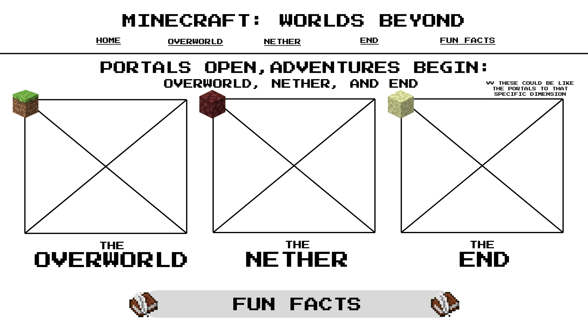
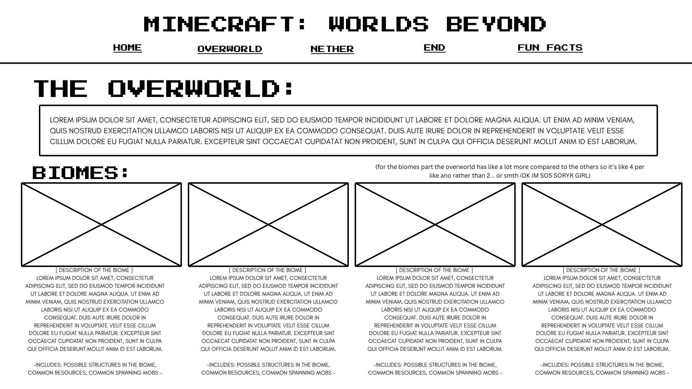
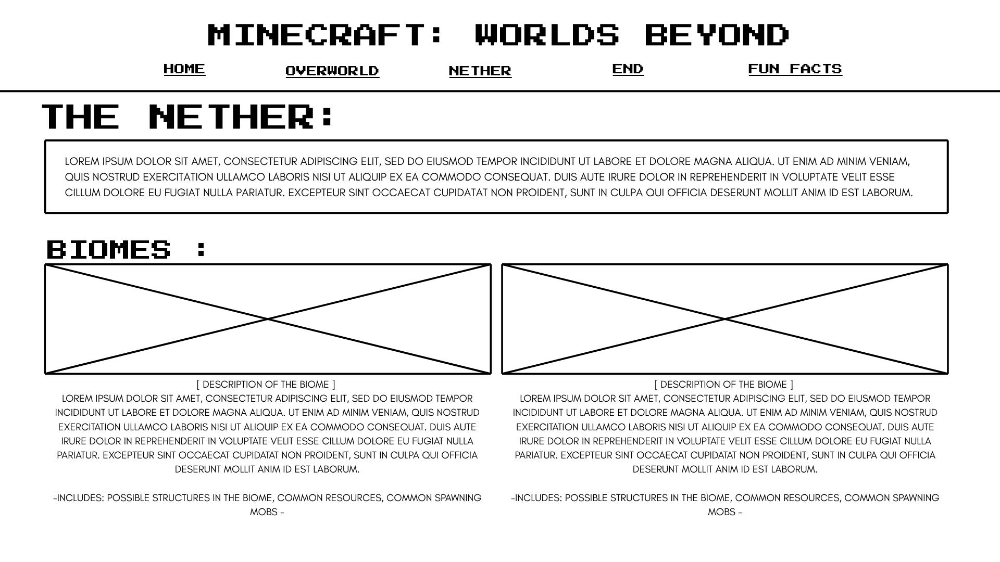
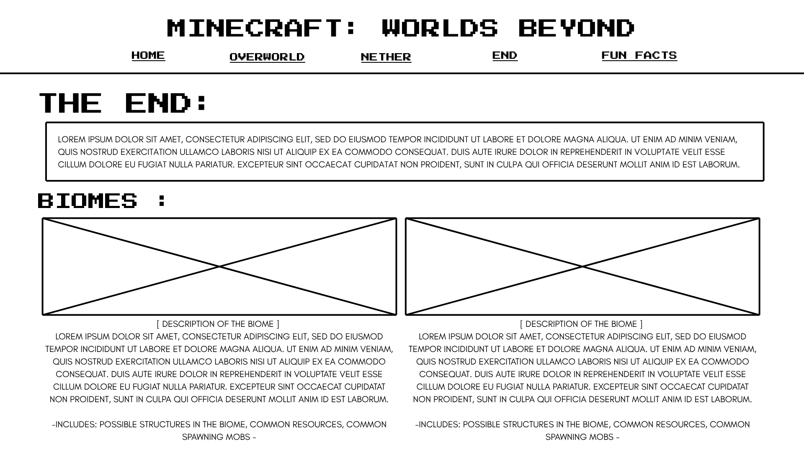
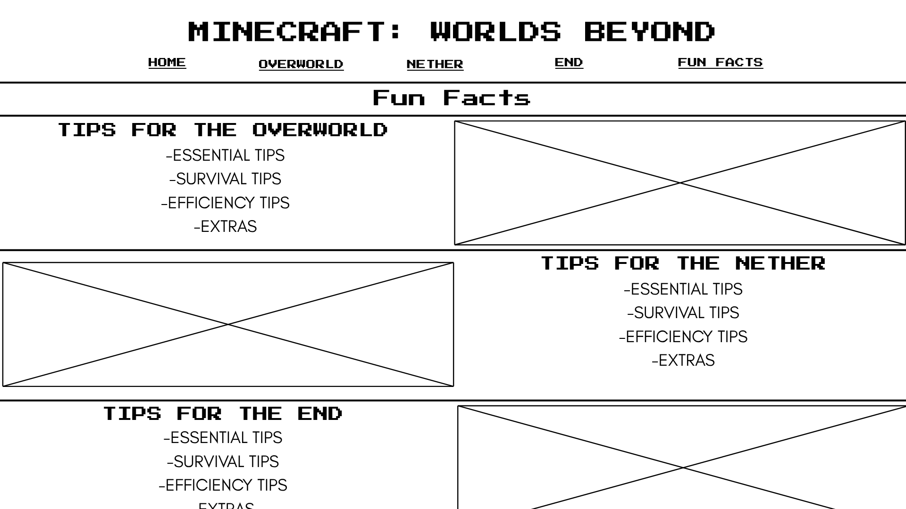

# 🌍 Minecraft: Worlds Beyond

## 🌀 Portals Open, Adventures Begin: The Overworld, Nether, and End

### Logo Concept
A **circular portal split into three parts** representing the **Overworld**, **Nether**, and **End**.

---

### Website Description
**Minecraft: Worlds Beyond** is the ultimate guide for Minecraft gamers who are ready to dive into the three primary dimensions — **Overworld**, **Nether**, and **End**.  

Explore biomes, buildings, mobs, and materials from each dimension while learning survival tips and growth advice for your adventures. Whether you’re a beginner or a pro, this site provides everything you need to thrive in every world.

## Website Outline (5 Pages)

| **Page**      | **Subtitle / Content** |
|----------------|------------------------|
| **Home**       | An introduction to the three dimensions visually through the portals. From here, visitors can navigate to each dimension’s page. |
| **Overworld**  | Biomes (forest, desert, plains, mountains), Villages, Temples, Strongholds, Passive mobs. |
| **Nether**     | Biomes (Crimson Forest, Soul Sand Valley), Fortresses, Bastions, Hostile mobs, Lava lakes. |
| **End**        | End islands, End cities, Endermen, Ender dragon, and rare structures. |
| **Fun Facts**  | Survival tips 101! Learn how to: <ul><li>Move from one world to another</li><li>Survive each world</li><li>Use tools and potions effectively</li><li>Craft essential items</li></ul> |

---

## JavaScript Incorporation
- **Interactive Portal Animation**: Hovering over each portal on the homepage reveals a preview of the corresponding dimension.  
- **Random Biome Generator**: A button that displays a random biome from any of the three worlds (Overworld, Nether, End).  
- **Optional Feature**: Collapsible info boxes for mobs or structures to keep pages neat and readable.  

---

## Wireframe/Mockup
### 🏠 Homepage

### 🌳 Overworld Page

### 🌋 Nether Page

### 🕳️ End Page

### 📘 Content Page 1 - Dimensions

### 💡 Content Page 2 - Fun Facts

---

## Footer
Displayed on **all pages**:
<ul>
<li>Include in all pages
<li>© 2025 Exploring the Three Dimensions
<li>Social media links (Minecraft’s actual Twitter, Discord, YouTube icons)
<li>Source citations for images and info
</ul>

